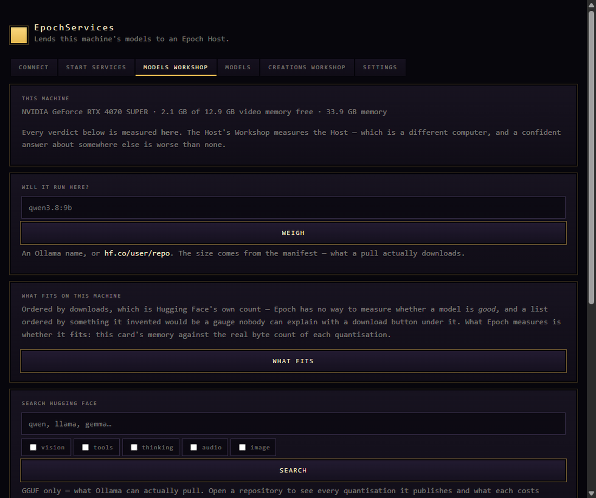

<div align="center">

# EpochServices

**Lend another computer's models to your crew.**

[](LICENSE)
[](#installing)
[](#how-it-is-built)

</div>

---

## What it is

You have a desk machine with a graphics card and a laptop you actually work on. Or a
Mac Studio sitting idle in another room. EpochServices runs on that other machine
and makes its models available to [Epoch](https://github.com/KislokX/Epoch) —
so a character on your laptop can think on the desktop's card.

It is a small, single-purpose program. It is **not** Epoch: it holds no crew, no
Quests, no Chronicles and no knowledge. It lends compute, and it says exactly what
it is lending.



---

## How it works

**Pairing is a code, typed once.** Press `SHOW A CODE` here, type it into Epoch
under `MACHINES` with this machine's address. The code is spent the moment it
works. There is no account, no cloud and no sign-in.

**Every runtime stays on `127.0.0.1`.** Ollama, llama.cpp and LM Studio are never
exposed to your network. The only thing listening is this program, and it answers
nobody without the secret your Host gave it.

**A turn names which runtime should run it; it can never name where one is.** The
address is this machine's to decide, not the caller's.

**Every verdict is measured here.** *Will this 14B model fit?* is a question about
*this* card, and EpochServices answers it about the machine it is running on. The
Host's own Workshop measures the Host — a confident answer about somewhere else is
worse than none.

---

## What it can do

| | |
|---|---|
| **Lend runtimes** | Ollama, llama.cpp and LM Studio, whichever are installed |
| **Weigh a model** | real byte counts from the manifest against this card's memory |
| **Find models** | Hugging Face and Ollama, ordered by downloads — never by an invented score |
| **Pull models** | onto this machine's disk, where they will actually run |
| **Lend a studio** | ComfyUI on this machine, so a picture is drawn on the card that can draw it |

Grants are per-machine and explicit: *may think for me* and *may drive my World
from there* are separate answers, and neither is assumed.

---

## Installing

**There is no release yet.** The first build has not been cut, so the
[Releases](../../releases) page is empty and this section describes what will be there
rather than what is. Until then, *Building from source* below is the whole of it.

When there is one: download the build for your platform, run it on the machine you want
to lend, and pair it from Epoch under `MACHINES`.

### It is not signed, and here is exactly what that means

Epoch has no code-signing certificate. One is a recurring cost, and buying it would remove a
warning rather than change anything the program does — so the honest thing is to say what you
will see and give you a way to check the file instead.

**Windows** shows *"Windows protected your PC"*. Press **More info**, then **Run anyway**. That
is Microsoft saying it has not seen this installer signed by a known publisher, which is true.

**macOS** blocks the first launch. Open it once, let it be refused, then go to **System Settings
→ Privacy & Security** and press **Open Anyway**. (On recent macOS the old right-click → Open
trick no longer works.)

**What you can check instead of a signature.** Every release carries a `SHA256SUMS` beside the
files, and each build is published with **GitHub build provenance** — a signed statement, in a
public transparency log, that the file came from this repository at a specific commit and was
built on GitHub's runners rather than on somebody's desktop:

```bash
gh attestation verify <the file you downloaded> --repo KislokX/Epoch-Services
```

That does not tell you who wrote it. It tells you that the file you are holding is the one this
repository produced, which is the question that actually matters when you download a binary.

## Building from source

EpochServices shares five crates with Epoch — `epoch-kernel`, `epoch-models`,
`epoch-assets`, `epoch-secrets` and `epoch-wire` — pinned by revision in `Cargo.toml`.
One copy of that code exists, in Epoch, and moving to a newer one is a deliberate edit
here.

`epoch-wire` is the handshake between the two programs, and it is shared for the reason
the others are not merely convenience: a handshake written twice is two handshakes, and
that is the one place a difference of opinion is a vulnerability rather than a bug.

**Working on both at once?** Put an Epoch checkout beside this one and add a
`.cargo/config.toml` with a `paths` override pointing at `../Epoch/BUILD/crates/*`.
Cargo then builds against your local crates instead of the pinned revision, so a change
to a shared crate is caught here on the day it is made rather than on the day somebody
needs to deploy. That file is deliberately not committed: the path is yours, not this
repository's.

```bash
git clone https://github.com/KislokX/Epoch-Services
cd Epoch-Services
cargo build --release
```

Needs Rust (stable). On Linux, the usual webview dependencies — the CI workflow
lists them exactly.

```bash
cargo test
```

---

## How it is built

Rust and Tauri 2, with a server-rendered surface and no frontend build step. It
deliberately cannot link `epoch-engine`: a machine that lends compute has no
business holding domain state, and the crate boundary is what keeps that true
rather than a rule somebody has to remember.

---

## Licence

Apache-2.0. See [LICENSE](LICENSE) and [NOTICE](NOTICE).
